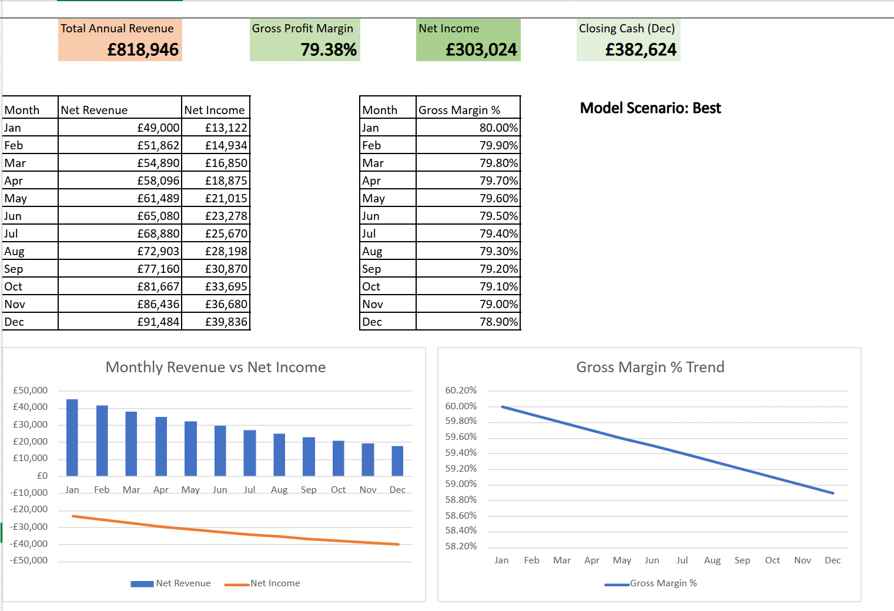

# SaaS Financial Model - Excel Dashboard & Scenario Planner
 
A dynamic financial model built in Microsoft Excel for a fictional SaaS startup, demonstrating scenario analysis, financial forecasting, and data visualisation skills.
 

 
---
 
## Overview
 
This project simulates a full financial planning cycle for a SaaS business - from raw assumptions through to a live KPI dashboard and sensitivity analysis. The model is driven by a single scenario dropdown (Best / Base / Worst) that cascades across every sheet automatically.
 
Built as a portfolio project to demonstrate financial modelling, advanced Excel skills, and business domain knowledge relevant to Data Analyst roles.
 
---
 
## Features
 
- **Dynamic Scenario Engine** - Best / Base / Worst case toggle updates the entire model in real time using `CHOOSE` and `MATCH` logic
- **SaaS P&L Model** - 12-month Profit & Loss with MRR growth, churn rate, cost creep simulation, and tax calculation
- **Cash Flow Statement** - Operating, investing, and financing activities with rolling monthly closing balance
- **KPI Dashboard** - Headline metrics, monthly Revenue vs Net Income combo chart, and Gross Margin % trend line
- **Variance Analysis** - Budget vs Actuals comparison with conditional formatting (favourable/unfavourable indicators)
- **Sensitivity Heat Map** - 4×4 matrix showing Net Income across 16 combinations of revenue growth rate and COGS %, colour-scaled from green (profitable) to red (loss-making)
---
 
## Sheets
 
| Sheet | Description |
|---|---|
| `Assumptions` | Master input sheet - scenario selector and all model drivers |
| `P&L` | 12-month SaaS Profit & Loss statement |
| `CashFlow` | Operating, investing, and financing cash flow |
| `Dashboard` | Visual KPI summary and charts |
| `Variance` | Budget vs Actuals and sensitivity analysis |
 
---
 
## Key Assumptions (Base Scenario)
 
| Driver | Value |
|---|---|
| Starting MRR | £50,000 |
| Monthly Revenue Growth | 5% |
| Churn Rate | 5% |
| COGS % of Revenue | 30% (+ 0.1%/month cost creep) |
| R&D (monthly) | £12,000 |
| Sales & Marketing (monthly) | £15,000 |
| G&A (monthly) | £7,000 |
| Tax Rate | 19% |
 
---
 
## Skills Demonstrated
 
- Financial modelling and SaaS business logic (MRR, churn, cost structure)
- Advanced Excel formulas: `CHOOSE`, `MATCH`, `SUMPRODUCT`, `INDIRECT`, `IF`, `SUM`
- Dynamic cross-sheet referencing
- Conditional formatting with favourable/unfavourable variance logic
- Combo charts and trend visualisation
- Sensitivity analysis across multiple variable combinations
---
 
## How to Use
 
1. Download `SaaS_Financial_Model_Rajdeep.xlsx`
2. Open in Microsoft Excel (desktop - some features require desktop app)
3. Navigate to the `Assumptions` sheet
4. Use the **Scenario dropdown in cell C1** to switch between Best / Base / Worst
5. Watch the P&L, Cash Flow, Dashboard, and Variance sheets update automatically
6. Navigate to `Dashboard` for the visual summary
---
 
## Project Context
 
This model was built as part of a data analytics portfolio targeting Data Analyst roles. The fictional business is a B2B SaaS startup in its first year of operation, pre-Series A, with seed funding of £100,000.
 
The churn vs growth dynamic was a deliberate modelling choice - in SaaS, a high growth rate can mask underlying retention problems. The sensitivity table surfaces exactly which combinations of growth and cost structure produce a viable business.
 
---
 
## Author
 
**Rajdeep Gupta**
MSc Artificial Intelligence - Loughborough University
 
---
 

